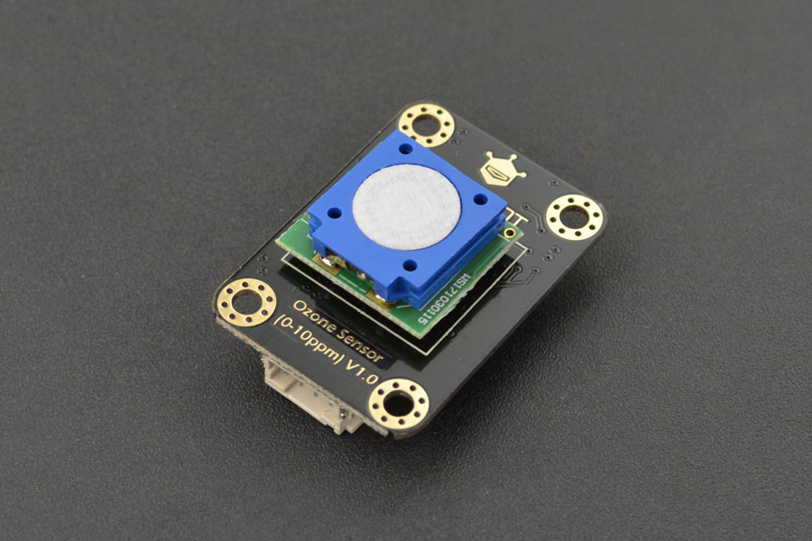

# DFRobot_OzoneSensor
- [中文版](./README_CN.md)

This is a compact arduino compatible ozone sensor module that can easily and accurately measure the concentration of ozone gas in the environment. <br>
It can be widely used in portable instruments, air quality monitoring equipment, disinfection cabinets, smart homes and other equipment places. <br>




## Product Link(https://www.dfrobot.com/product-1832.html)

    SKU：SEN0321

## Table of Contents

* [Summary](#Summary)
* [Installation](#Installation)
* [Methods](#Methods)
* [Compatibility](#Compatibility)
* [History](#History)
* [Credits](#Credits)

## Summary

- The ozone sensor launched by DFRobot adopts the principle of electrochemistry and has been calibrated before leaving the factory, which can accurately measure the ozone concentration in the environment.<br>
- And it has the characteristics of anti-interference, high stability and high sensitivity. <br>
- The resolution can reach 10ppb<br>
- support 3.3~5.5V wide voltage input<br>
- use I2C output<br>
- compatible with mainstream devices such as Arduino, ESP32, Raspberry Pi, etc<br>
- the service life in the air is up to two years<br>

## Installation
Download the library file before use, paste it into the custom directory for Raspberry Pi, then open the examples folder and run the demo in the folder.

## Methods

```python
  '''!
    @brief set the mode
    @param MEASURE_MODE_AUTOMATIC  active mode
    @param MEASURE_MODE_PASSIVE    passive mode
  '''
  def set_mode(self ,mode):

  '''!
    @brief get the ozone data
    @param collectnum Collect the number
    @return ozone concentration, (units PPB)
  '''
  def get_ozone_data(self ,collectnum):
    
```

## Compatibility

* RaspberryPi Version

| Board        | Work Well | Work Wrong | Untested | Remarks |
| ------------ | :-------: | :--------: | :------: | ------- |
| RaspberryPi2 |           |            |    √     |         |
| RaspberryPi3 |     √     |            |          |         |
| RaspberryPi4 |           |            |    √     |         |

* Python Version

| Python  | Work Well | Work Wrong | Untested | Remarks |
| ------- | :-------: | :--------: | :------: | ------- |
| Python2 |     √     |            |          |         |
| Python3 |     √     |            |          |         |


## History

- 2020/5/27 - V1.0.0 Version

## Credits

Written by ZhixinLiu(zhixin.liu@dfrobot.com), 2020. (Welcome to our [website](https://www.dfrobot.com/))
